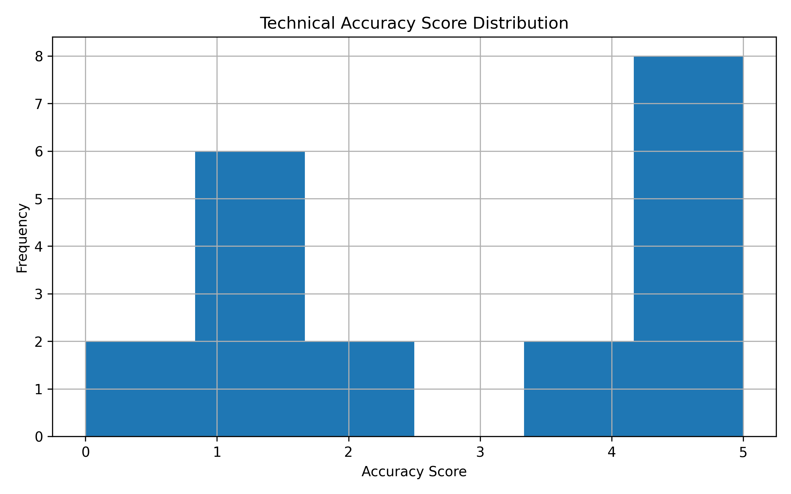
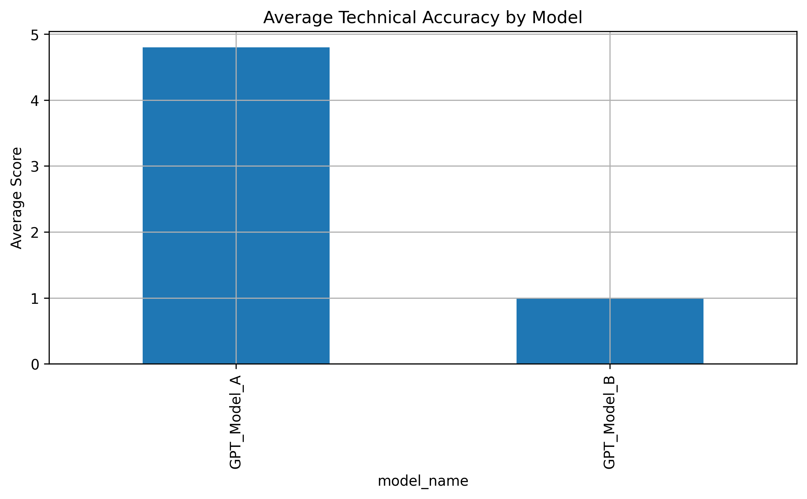
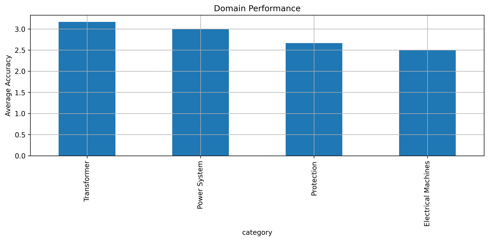
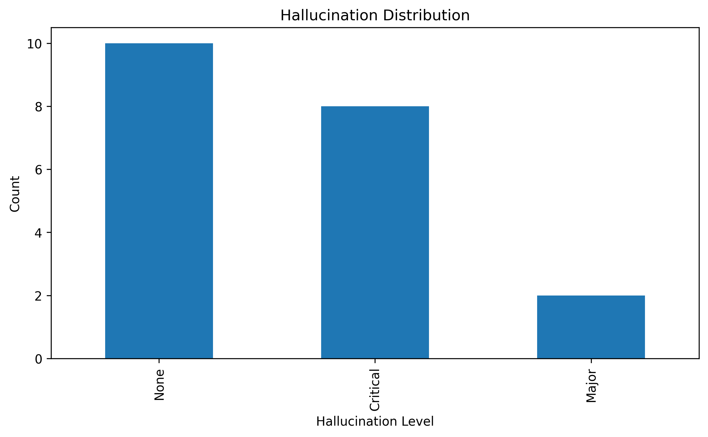
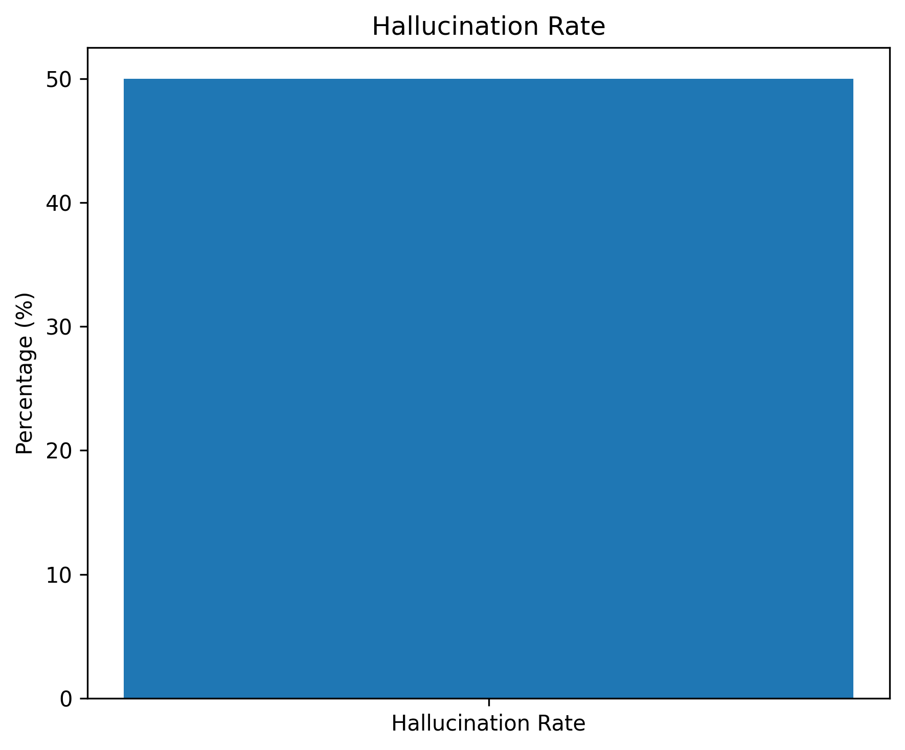

# Electrical Engineering AI Evaluation Benchmark

A Python-based benchmarking framework for evaluating AI-generated responses on Electrical Engineering tasks.

This project provides a structured methodology for assessing technical accuracy, semantic similarity, factual consistency, and hallucination behavior in AI-generated answers across multiple Electrical Engineering domains.

---

## Overview

Large Language Models (LLMs) are increasingly used to assist engineers in technical problem-solving and knowledge retrieval. However, evaluating the reliability of AI-generated engineering responses requires domain-specific benchmarks.

This project implements an evaluation pipeline that measures:

- Technical Accuracy
- Semantic Similarity
- Hallucination Detection
- Domain-Level Performance
- Benchmark Visualization

---

## Evaluation Domains

The benchmark includes Electrical Engineering questions from multiple technical areas:

- Transformers
- Power Systems
- Electrical Machines
- Protection Systems
- Power Distribution
- Fault Analysis
- Circuit Analysis

---

## Project Structure

```text
electrical-engineering-ai-evaluation-benchmark/
│
├── data/
│   ├── raw/
│   │   ├── electrical_qa_dataset.csv
│   │   ├── ground_truth_answers.csv
│   │   └── ai_generated_answers.csv
│   │
│   ├── processed/
│   │   ├── benchmark_dataset.csv
│   │   └── evaluation_results.csv
│   │
│   └── sample/
│       ├── sample_questions.csv
│       └── sample_evaluation.csv
│
├── src/
│   ├── evaluation/
│   ├── visualization/
│   └── utils/
│
├── results/
│   └── figures/
│       ├── accuracy_distribution.png
│       ├── benchmark_overview.png
│       ├── domain_performance.png
│       ├── hallucination_distribution.png
│       └── hallucination_rate.png
│
├── requirements.txt
├── LICENSE
└── README.md
```

---

## Evaluation Metrics

### Technical Accuracy Score

Measures engineering correctness on a scale of:

| Score | Description |
|---------|---------|
| 5 | Completely correct |
| 4 | Minor technical issues |
| 3 | Partially correct |
| 2 | Significant errors |
| 1 | Incorrect answer |

---

### Similarity Score

Measures semantic similarity between:

- Ground Truth Answer
- AI Generated Answer

Range:

```text
0.00 - 1.00
```

Higher values indicate stronger alignment.

---

### Hallucination Analysis

The benchmark identifies:

- Unsupported technical claims
- Fabricated engineering facts
- Incorrect calculations
- Invalid technical references

---

## Visualization Outputs

### Accuracy Distribution



---

### Benchmark Overview



---

### Domain Performance



---

### Hallucination Distribution



---

### Hallucination Rate



---

## Installation

Clone the repository:

```bash
git clone https://github.com/yourusername/electrical-engineering-ai-evaluation-benchmark.git

cd electrical-engineering-ai-evaluation-benchmark
```

Create virtual environment:

```bash
python -m venv venv
```

Activate environment:

### Windows

```bash
venv\Scripts\activate
```

### Linux / macOS

```bash
source venv/bin/activate
```

Install dependencies:

```bash
pip install -r requirements.txt
```

---

## Usage

Generate benchmark visualizations:

```bash
python src/visualization/score_distribution.py

python src/visualization/hallucination_charts.py

python src/visualization/benchmark_dashboard.py
```

---

## Sample Evaluation Output

| Question ID | Model | Category | Accuracy | Similarity |
|------------|------------|------------|------------|------------|
| 1 | GPT_Model_A | Transformer | 5 | 0.94 |
| 2 | GPT_Model_A | Transformer | 5 | 0.96 |
| 3 | GPT_Model_A | Transformer | 5 | 0.92 |

---

## Applications

This benchmark framework can be used for:

- LLM Evaluation
- Engineering AI Auditing
- Technical Response Validation
- Hallucination Detection Research
- AI Quality Assurance
- Domain-Specific Benchmarking

---

## Future Improvements

Planned enhancements include:

- Multi-model comparison
- Automated fact verification
- RAG-based evaluation
- Statistical significance testing
- Expanded engineering datasets
- Interactive dashboards

---

## Technologies

- Python
- Pandas
- NumPy
- Matplotlib
- Scikit-learn

---

## License

This project is released under the MIT License.

---

## Author

Electrical Engineering & AI Evaluation Portfolio Project

Focused on evaluating the reliability and technical correctness of AI systems in engineering applications.